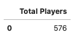
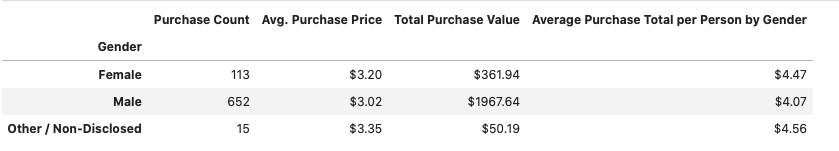
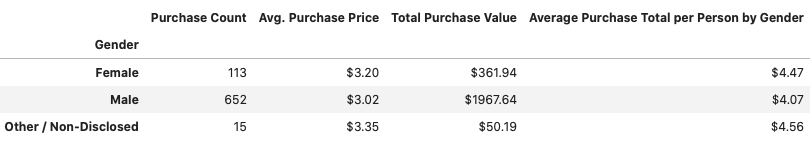
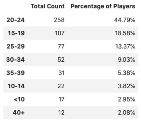
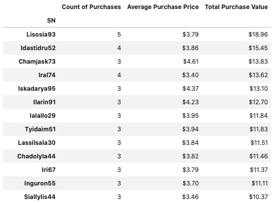
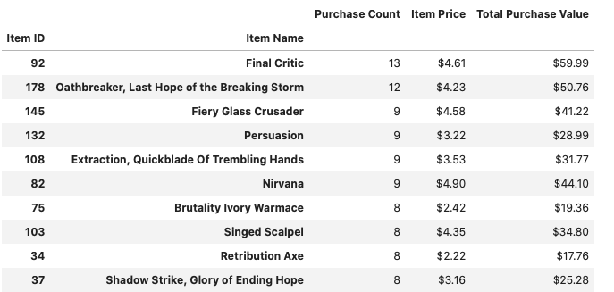
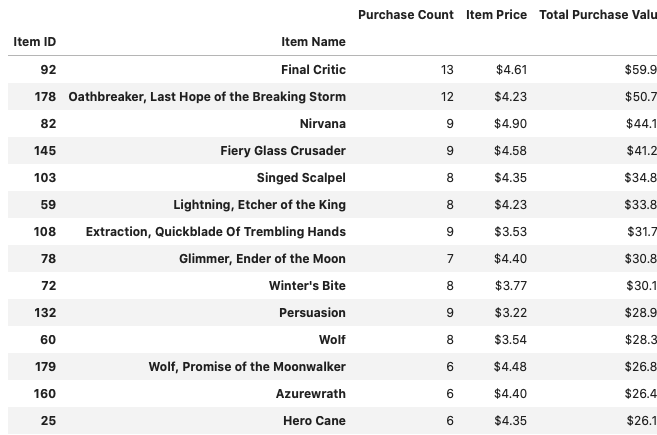

# Heroes Of Pymoli
 Python Pandas Scripts
## Option 1: Heroes of Pymoli


Congratulations! After a lot of hard work in the data munging mines, you've landed a job as Lead Analyst for an independent gaming company. You've been assigned the task of analyzing the data for their most recent fantasy game Heroes of Pymoli.

Like many others in its genre, the game is free-to-play, but players are encouraged to purchase optional items that enhance their playing experience. As a first task, the company would like you to generate a report that breaks down the game's purchasing data into meaningful insights.

## Technologies
* Python
* Pandas
* Numpy
* Pathlib


Your final report should include each of the following:

## Player Count

* Total Number of Players
```python
# Calculate total number of unique players
unique_player = purchase_raw_data_df['SN'].nunique(dropna=True)

# Display number of unique players
unique_player_dicts = [{"Total Players": (unique_player)}]
total_players_df = pd.DataFrame(unique_player_dicts)
total_players_df
```


## Purchasing Analysis (Total)

* Number of Unique Items
* Average Purchase Price
* Total Number of Purchases
* Total Revenue

```python
#Number of Unique Items
unique_items_df = purchase_raw_data_df['Item ID'].nunique()

# Average Purchase Price
average_price_df = purchase_raw_data_df['Price'].mean()

# Total Number of Purchases
total_purchase_df = purchase_raw_data_df['Purchase ID'].count()

# Total Revenue
total_revenue_df = purchase_raw_data_df['Price'].sum()

# Display the summary data frame
Summary_df_dicts = [{"Number of Unique Items":unique_items_df,
                    "Average Purchase Price":average_price_df,
                    "Total Number of Purchases":total_purchase_df,
                    "Total Revenue":total_revenue_df}]
Summary_df = pd.DataFrame(Summary_df_dicts)
Summary_df.round(2)

Summary_df.head().style.format({"Average Purchase Price":"${0:.2f}",
                                         "Total Revenue":"${0:.2f}"})
```


## Gender Demographics

* Percentage and Count of Male Players
* Percentage and Count of Female Players
* Percentage and Count of Other / Non-Disclosed

```python
#Number of Unique Items
unique_items_df = purchase_raw_data_df['Item ID'].nunique()

# Average Purchase Price
average_price_df = purchase_raw_data_df['Price'].mean()

# Total Number of Purchases
total_purchase_df = purchase_raw_data_df['Purchase ID'].count()

# Total Revenue
total_revenue_df = purchase_raw_data_df['Price'].sum()
```



## Purchasing Analysis (Gender)

* The below each broken by gender
  * Purchase Count
  * Average Purchase Price
  * Total Purchase Value
  * Average Purchase Total per Person by Gender

```python
# gender purchase count
gender_purchases_df = purchase_raw_data_df.groupby("Gender")["Item Name"].count()

# gender avg. purchase price
gender_average_df = purchase_raw_data_df.groupby("Gender")["Price"].mean()

 # total price by gender
gender_totalp_df = purchase_raw_data_df.groupby("Gender")["Price"].sum()

# total price by gender per person
gender_per_df = gender_totalp_df/gender_count_df

#summary data frame
gender_demo_df = pd.DataFrame({"Purchase Count":gender_purchases_df,
                              "Avg. Purchase Price":gender_average_df,
                              "Total Purchase Value":gender_totalp_df,
                              "Average Purchase Total per Person by Gender":gender_per_df}).round(2) 
#gender_demo_df

gender_demo_df.style.format({"Avg. Purchase Price":"${0:.2f}",
                                        "Total Purchase Value":"${0:.2f}",
                                     "Average Purchase Total per Person by Gender":"${0:.2f}"})                                       
```


## Age Demographics

* The below each broken into bins of 4 years (i.e. &lt;10, 10-14, 15-19, etc.)
  * Purchase Count
  * Average Purchase Price
  * Total Purchase Value
  * Average Purchase Total per Person by Age Group
  
```python
# Create new dataframe
age_demographics = purchase_raw_data_df[['Age','SN']].drop_duplicates()

age_bins =[0, 9.90, 14.90, 19.90, 24.90, 29.90, 34.90, 39.90, 99999]
group_names =["<10","10-14", "15-19", "20-24", "25-29" , "30-34", "35-39", "40+"]

# Categorize the existing players using the age bins 
age_demographics['Age Group'] = pd.cut(age_demographics['Age'], age_bins, labels=group_names)

# Run calculations:

# Total count
age_count = age_demographics['Age Group'].value_counts()

# Percentage of players
age_percentage = np.round(age_count / unique_player * 100, decimals=2)

# Create and display summary data frame
age_demographics = pd.DataFrame({'Total Count': age_count, 'Percentage of Players': age_percentage})
age_demographics.sort_index()

age_demographics.style.format({'Percentage of Players':"{0:.2f}%"})

```


## Top Spenders

* Identify the the top 5 spenders in the game by total purchase value, then list (in a table):
  * SN
  * Purchase Count
  * Average Purchase Price
  * Total Purchase Value

```python
# total amount players have spent (SN)
ttl_purch_age_df = purchase_raw_data_df.groupby("SN")["Price"].sum()

# Purchase Count
purch_age_count = purchase_raw_data_df.groupby("SN")["Price"].count()

# Average Purchase Price
avg_purch_price = purchase_raw_data_df.groupby("SN")["Price"].mean()

#count of purchases by player
purch_count = purchase_raw_data_df.groupby("SN")["Price"].count()

#Create a summary data frame to hold the results
purchasing_analysis_df = pd.DataFrame({"Count of Purchases": purch_count, 
                                       "Average Purchase Price": avg_purch_price, 
                                       "Total Purchase Value": ttl_purch_age_df}).round(2)

purchasing_analysis_df = purchasing_analysis_df.sort_values("Total Purchase Value", ascending=False)

purchasing_analysis_df = purchasing_analysis_df.style.format({"Average Purchase Price":"${0:.2f}",
                                     "Total Purchase Value":"${0:.2f}"})
                                         
purchasing_analysis_df

```


## Most Popular Items

* Identify the 5 most popular items by purchase count, then list (in a table):
  * Item ID
  * Item Name
  * Purchase Count
  * Item Price
  * Total Purchase Value
  
```python
#purchase count
popular_count = purchase_raw_data_df.groupby(['Item ID','Item Name']).count()['Price']

#item price
popular_price = purchase_raw_data_df.groupby(['Item ID','Item Name']).mean()['Price']

#total purchase value
popular_sum = purchase_raw_data_df.groupby(['Item ID','Item Name']).sum()['Price']

#Most Popular Items Data Frame,Sort the purchase count column in descending order 
popular_df = pd.DataFrame({'Purchase Count':popular_count,
                          'Item Price':popular_price,
                          'Total Purchase Value':popular_sum})
popular_df = popular_df.sort_values(by="Purchase Count",ascending=False)

popular_df = popular_df.style.format({"Item Price":"${0:.2f}",
                                     "Total Purchase Value":"${0:.2f}"})
popular_df

```


## Most Profitable Items

* Identify the 5 most profitable items by total purchase value, then list (in a table):
  * Item ID
  * Item Name
  * Purchase Count
  * Item Price
  * Total Purchase Value

```python
#Purchase Count
most_profit_count= purchase_raw_data_df.groupby(['Item ID','Item Name']).count()['Price']

#Item Price
most_profit_price= purchase_raw_data_df.groupby(['Item ID','Item Name']).mean()['Price']

#Total Purchase Value
most_profit_sum= purchase_raw_data_df.groupby(['Item ID','Item Name']).sum()['Price']

#Data Frame for Most Profitable Items
most_profit_df =pd.DataFrame({'Purchase Count':most_profit_count,
                          'Item Price':most_profit_price,
                          'Total Purchase Value':most_profit_sum})
most_profit_df = most_profit_df.sort_values(by="Total Purchase Value",ascending=False)
most_profit_df.round(2)

most_profit_df = most_profit_df.style.format({"Item Price":"${0:.2f}",
                                     "Total Purchase Value":"${0:.2f}"})
                                         
most_profit_df 

```


## Observations
* Gender Demographics:
There is a definite gender trend, with male identified customers making up 84.03 % of the players compared to female identified customers at 14.06%.  What is interesting is that female customers that play the game are willing to spend 40 cents more than males even though they make up the low percentage of the players.   Also, in the data there is a non-disclosed gender which makes up 1.91% of the gender data.  The non-disclosed gender is willing to spend more than the female and male gender.  Perhaps it would be good to test a genderless character to the game.  Also, add more marketable elements to the female audience in the game so they can gain more customers.

* Age Demographics: 
The age range that has the most purchases at 365 is 20-24 yrs, in second is 15-19 yrs at 136, at third is 25-29 years at 101.  The age range that will spend the most is 35-39 years at an average purchase of $3.60 compared to the 20-24 yrs at $3.05 average purchase.  They should try to make parts of the game more appealing to the 15-19 yrs age range and the 35-39 age rage since they spend the most. 

* Most Popular Items: 
The Final Critic and Oathbreaker, Last Hope of the Breaking Storm are the most popular items.  It would be good to understand what the common element between both of them is and to add more of those items to increase revenues. 

* Conclusion:
There seems to be a common reoccurring theme that they need to appeal to the female audience and the older they are the more they will spend.  Also, they need figure out what is the most common element of the top 2 popular items and then replicate them. 

